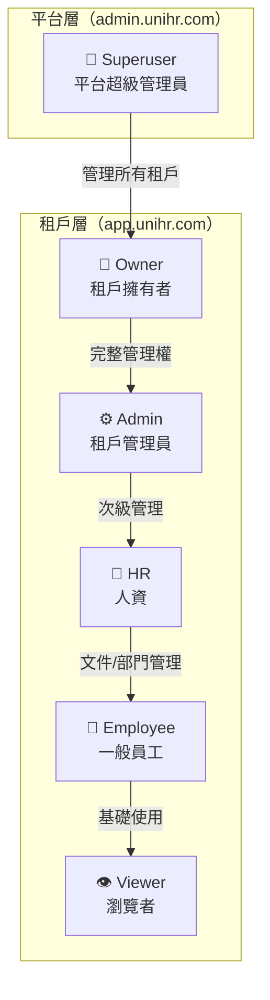
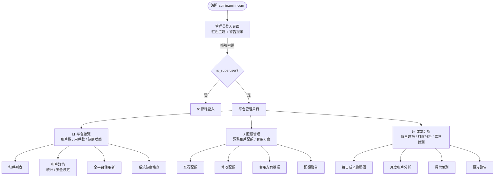

# UniHR SaaS — UX 流程全角色檢視報告

> **建立日期**：2026-02-07  
> **檢視者**：UX 工程師  
> **涵蓋範圍**：租戶前端（app.unihr.com）＋ Admin 後台（admin.unihr.com）  
> **系統版本**：Phase 1-4 完成後

---

## 目錄

1. [角色定義](#一角色定義)
2. [系統架構圖](#二系統架構圖)
3. [租戶前端用戶旅程圖](#三租戶前端用戶旅程圖)
4. [Admin 後台管理流程圖](#四admin-後台管理流程圖)
5. [各角色 Page 可見性矩陣](#五各角色-page-可見性矩陣)
6. [流程問題盤點](#六流程問題盤點)
7. [各角色完整流程詳審](#七各角色完整流程詳審)
8. [後端權限強制矩陣](#八後端權限強制矩陣)
9. [建議修復優先順序](#九建議修復優先順序)

---

## 一、角色定義

| 角色 | 系統 | 權限等級 | 說明 |
|------|------|---------|------|
| **Superuser** | Admin 後台 | 最高 | 平台營運者，跨租戶管理所有租戶與基礎設施 |
| **Owner** | 租戶前台 | 租戶最高 | 公司擁有者，完整管理權（含訂閱升級） |
| **Admin** | 租戶前台 | 高 | 公司管理員，等同 Owner（除訂閱升級外） |
| **HR** | 租戶前台 | 中 | 人資人員，可管理文件上傳與部門 |
| **Employee** | 租戶前台 | 低 | 一般員工，AI 問答與文件瀏覽 |
| **Viewer** | 租戶前台 | 最低 | 瀏覽者，唯讀存取 |

### 角色繼承關係

```
平台層（admin.unihr.com）
  └── Superuser（平台超級管理員）
        ↓ 管理所有租戶

租戶層（app.unihr.com）
  └── Owner（租戶擁有者）
        ↓ 完整管理權
      └── Admin（租戶管理員）
            ↓ 次級管理
          └── HR（人資）
                ↓ 文件/部門管理
              └── Employee（一般員工）
                    ↓ 基礎使用
                  └── Viewer（瀏覽者）
```

---

## 二、系統架構圖



---

## 三、租戶前端用戶旅程圖

```mermaid
flowchart TD
    Start([訪問 app.unihr.com]) --> Login[登入頁面]
    Login -->|帳號密碼| Auth[JWT 認證]
    Login -->|SSO| SSOFlow[SSO 流程]
    SSOFlow -->|輸入 Tenant ID| GetProviders[取得 SSO Providers]
    GetProviders -->|Google| GoogleOAuth[Google OAuth]
    GetProviders -->|Microsoft| MicrosoftOAuth[Microsoft OAuth]
    GoogleOAuth -->|Callback| SSOCallback[/login/callback]
    MicrosoftOAuth -->|Callback| SSOCallback
    SSOCallback -->|成功| Home[首頁 AI 問答]
    Auth -->|成功| Home
    Auth -->|失敗| Login

    Home --> Chat[💬 AI 問答<br/>所有角色]
    Home --> Docs[📄 文件管理<br/>所有角色（上傳需 HR+）]

    Home -->|Owner/Admin| Usage[📊 用量統計]
    Home -->|Owner/Admin| Audit[📋 稽核日誌]
    Home -->|Owner/Admin/HR| Dept[🏢 部門管理]
    Home -->|Owner/Admin| Company[🏠 公司管理]
    Home -->|Owner/Admin| Brand[🎨 品牌設定]
    Home -->|Owner/Admin| Sub[💳 訂閱方案]
    Home -->|Owner/Admin| SSO[🔑 SSO 設定]

    Company --> CompDash[儀表板]
    Company --> CompUsers[使用者管理]
    Company --> CompQuota[配額查看]
    Company --> CompUsage[用量分析]
```

### 頁面說明

| 頁面 | 路由 | 元件 | 說明 |
|------|------|------|------|
| 登入 | `/login` | `LoginPage.tsx` | 帳號密碼 + SSO（Google/Microsoft）|
| SSO Callback | `/login/callback` | `SSOCallbackPage.tsx` | OAuth 回調處理 |
| AI 問答 | `/` (index) | `ChatPage.tsx` | 對話列表 + 即時問答 + 引用來源 |
| 文件管理 | `/documents` | `DocumentsPage.tsx` | 文件 CRUD + 拖拉上傳 + 狀態 Polling |
| 用量統計 | `/usage` | `UsagePage.tsx` | Token/費用/查詢統計 + CSV/PDF 匯出 |
| 稽核日誌 | `/audit` | `AuditLogsPage.tsx` | 操作日誌 + 篩選 + 匯出 |
| 部門管理 | `/departments` | `DepartmentsPage.tsx` | 部門 CRUD |
| 公司管理 | `/company` | `CompanyPage.tsx` | 4 Tab（儀表板/使用者/配額/用量）|
| 品牌設定 | `/branding` | `BrandingPage.tsx` | Logo/色彩/名稱/Favicon |
| 訂閱方案 | `/subscription` | `SubscriptionPage.tsx` | 方案對比 + 升級 |
| SSO 設定 | `/sso-settings` | `SSOSettingsPage.tsx` | SSO Provider CRUD + 啟停 |

---

## 四、Admin 後台管理流程圖



### Admin 後台頁面

| 頁面 | 路由 | 元件 | 說明 |
|------|------|------|------|
| 管理員登入 | `/login` | `LoginPage.tsx` | Superuser 專用，紅色主題 |
| 平台管理 | `/` (index) | `AdminPage.tsx` | 5 Tab（總覽/租戶/使用者/安全/健康）|
| 配額管理 | `/quotas` | `AdminQuotaPage.tsx` | 租戶配額調整 + 方案套用 |
| 成本分析 | `/analytics` | `AnalyticsPage.tsx` | Recharts 圖表 + 異常偵測 |

---

## 五、各角色 Page 可見性矩陣

### 租戶前端（app.unihr.com）

| 頁面 | Owner | Admin | HR | Employee | Viewer |
|------|:-----:|:-----:|:--:|:--------:|:------:|
| AI 問答 | ✅ | ✅ | ✅ | ✅ | ✅ |
| 文件管理（瀏覽） | ✅ | ✅ | ✅ | ✅ | ✅ |
| 文件管理（上傳/刪除） | ✅ | ✅ | ✅ | ❌ | ❌ |
| 用量統計 | ✅ | ✅ | ❌ | ❌ | ❌ |
| 稽核日誌 | ✅ | ✅ | ❌ | ❌ | ❌ |
| 部門管理 | ✅ | ✅ | ✅ | ❌ | ❌ |
| 公司管理 | ✅ | ✅ | ❌ | ❌ | ❌ |
| 品牌設定 | ✅ | ✅ | ❌ | ❌ | ❌ |
| 訂閱方案 | ✅ | ✅ | ❌ | ❌ | ❌ |
| SSO 設定 | ✅ | ✅ | ❌ | ❌ | ❌ |
| 自訂域名 | ✅ | ✅ | ❌ | ❌ | ❌ |
| 區域設定 | ✅ | ✅ | ❌ | ❌ | ❌ |

### Admin 後台（admin.unihr.com）

| 頁面 | Superuser | 其他角色 |
|------|:---------:|:--------:|
| 平台管理 | ✅ | ❌ |
| 配額管理 | ✅ | ❌ |
| 成本分析 | ✅ | ❌ |
| 區域管理 | ✅ | ❌ |

---

## 六、流程問題盤點

### 🔴 嚴重問題（功能缺失）

| # | 問題 | 影響角色 | 說明 |
|---|------|---------|------|
| **F-1** | **無 CustomDomainsPage** | Owner/Admin | 後端有 4 個 CRUD 端點（T4-6），但前端無頁面、無路由、無導航入口、無 API 函式 |
| **F-2** | **無 RegionsPage** | Owner/Admin/Superuser | 後端有 6 個端點（T4-19），前端完全無對應 UI。Admin 後台的租戶詳情也不顯示 region 欄位 |
| **F-3** | **Admin 後台無區域管理** | Superuser | 無法在後台設定/遷移租戶區域，也無法查看資料駐留合規摘要 |

### 🟡 UX 設計缺陷

| # | 問題 | 影響角色 | 說明 |
|---|------|---------|------|
| **U-1** | **Employee/Viewer 導航過少** | Employee, Viewer | 只看到 2 個頁面（AI 問答 + 文件管理），側邊欄空曠，缺乏「我的」體驗感 |
| **U-2** | **Viewer 可使用 AI 問答** | Viewer | 後端 `chat.py` 和 `kb.py` 無角色限制，Viewer 可完整使用 AI 對話。若 Viewer 設計為「只看不做」，邏輯矛盾 |
| **U-3** | **文件頁面無部門篩選** | All | DocumentsPage 列出全部文件，無法按部門篩選。但後端有部門模型，文件也有 `department_id` 欄位 |
| **U-4** | **路由無角色守衛** | Employee, Viewer | `App.tsx` 只檢查 token，不檢查角色。Employee 可直接輸入 `/audit` URL 存取——雖然後端會擋 API，但前端顯示空頁面或錯誤 |
| **U-5** | **SSO 需手動輸入 Tenant ID** | All | LoginPage SSO 流程要求手動填 Tenant ID（UUID），一般使用者不知道 |
| **U-6** | **品牌設定無即時預覽** | Owner/Admin | 儲存後提示「重新整理頁面即可看到」，應即時預覽 |
| **U-7** | **訂閱升級無確認流程** | Owner | 只有原生 `confirm()` 彈窗，缺乏計費詳情、生效日期等 |

### 🟢 前後端權限一致性問題

| # | 問題 | 說明 |
|---|------|------|
| **P-1** | **導航隱藏 ≠ 路由保護** | Layout 用 `roles` 控制導航顯示，但 `App.tsx` 路由不做角色檢查。直接輸入 URL 可進入頁面（API 會 403 但 UX 差） |
| **P-2** | **後端權限檢查不一致** | `admin.py` 用 `Depends(require_superuser)`，`tenant_admin.py` 用 inline `_ensure_owner_admin()`，`tenants.py` 用 `if not current_user.is_superuser`。三種方式混用 |
| **P-3** | **tenant_admin.py import require_admin 但未使用** | Import 了卻改用本地函式，死碼 |
| **P-4** | **subscription.py plans 端點完全公開** | `GET /subscription/plans` 無需認證，方案資訊是否為敏感資訊需評估 |

---

## 七、各角色完整流程詳審

### Role 1: Employee（一般員工）

```
登入 → AI 問答（預設頁）
       ├── 新建對話 ✅
       ├── 歷史對話列表 ✅
       ├── 刪除對話 ✅
       └── 引用來源顯示（勞動法 / 公司政策）✅
     → 文件管理
       ├── 瀏覽文件列表 ✅
       ├── 上傳文件 ❌（canManage = false）
       └── 刪除文件 ❌（canManage = false）
     → 登出 ✅
```

**問題**：
- 側邊欄只有 2 個選項，視覺空洞
- 缺少「個人設定」頁面（修改密碼、偏好設定）
- 無法查看自己的使用量
- 文件只能看不能搜尋（但可透過 AI 問答間接搜尋）

---

### Role 2: HR（人資）

```
登入 → AI 問答 ✅
     → 文件管理
       ├── 瀏覽 ✅
       ├── 上傳 ✅（canManage = true）
       ├── 拖拉上傳 ✅
       ├── 刪除 ✅
       └── 處理狀態即時更新（polling）✅
     → 部門管理
       ├── 部門列表 ✅
       ├── 建立部門 ✅
       └── 停用部門 ✅
     → 登出 ✅
```

**問題**：
- 部門管理無樹狀結構顯示（模型支援 `parent_id` 但 UI 只是平面列表）
- 無法指派使用者到部門（需從公司管理頁面操作，但 HR 看不到）
- 文件無法指派到部門

---

### Role 3: Owner / Admin（租戶管理者）

```
登入 → AI 問答 ✅
     → 文件管理 ✅（完整 CRUD）
     → 用量統計
       ├── 總覽卡片（Token / 費用 / 查詢數）✅
       ├── 按動作類型分析表 ✅
       └── 匯出 CSV / PDF ✅
     → 稽核日誌
       ├── 日誌列表（含篩選）✅
       └── 匯出 CSV / PDF ✅
     → 部門管理 ✅
     → 公司管理
       ├── 儀表板（KPI 卡片）✅
       ├── 使用者管理（邀請 / 編輯 / 停用）✅
       ├── 配額查看 ✅
       └── 用量分析（按使用者）✅
     → 品牌設定
       ├── Logo URL ✅
       ├── 主色/副色 ✅
       ├── 品牌名稱 ✅
       └── Favicon ✅
     → 訂閱方案
       ├── 方案列表（Free / Pro / Enterprise）✅
       ├── 當前方案 ✅
       ├── 功能對比 ✅
       └── 升級 ✅（Owner 限定）
     → SSO 設定
       ├── 查看已配置 Provider ✅
       ├── 新增 Google / Microsoft ✅
       ├── 啟用/停用 ✅
       └── 刪除 ✅
     → 自訂域名 ❌ **缺失**
     → 區域設定 ❌ **缺失**
     → 登出 ✅
```

---

### Role 4: Superuser（Admin 後台）

```
登入（admin.unihr.com）→ 平台管理
     ├── 平台總覽
     │   ├── 租戶列表（搜尋 / 狀態篩選）✅
     │   ├── 租戶詳情（統計 / 安全設定）✅
     │   ├── 全平台使用者列表 ✅
     │   └── 系統健康檢查 ✅
     ├── 配額管理
     │   ├── 選擇租戶 ✅
     │   ├── 查看/修改配額 ✅
     │   ├── 套用方案模板 ✅
     │   └── 配額警告查看 ✅
     └── 成本分析
         ├── 每日趨勢圖（Recharts）✅
         ├── 月度租戶分析 ✅
         ├── 異常偵測 ✅
         └── 預算警告 ✅
     → 區域管理 ❌ **缺失**
     → 自訂域名管理 ❌ **缺失**
     → Celery Worker 監控 ❌ **缺失**
     → 登出 ✅
```

---

## 八、後端權限強制矩陣

### 認證依賴函式

| 依賴函式 | 說明 |
|----------|------|
| `get_current_user` | 解碼 JWT，回傳 `User` 物件（僅驗證 token 有效性） |
| `get_current_active_user` | 在 `get_current_user` 之上檢查 `is_active` |
| `require_superuser` | 要求 `is_superuser == True` |
| `require_admin` | `PermissionChecker(["owner", "admin"])` — 允許 owner/admin（superuser bypass） |
| `require_hr` | `PermissionChecker(["owner", "admin", "hr"])` |
| `check_document_permission` | 依 action（create/update/delete 需 owner/admin/hr；read 全開） |
| `check_audit_permission` | 限 superuser/owner/admin |
| `check_user_management_permission` | 限 superuser/owner/admin |
| `check_department_permission` | 限 superuser/owner/admin/hr |
| `check_feature_enabled` | 檢查功能模組是否對角色啟用 |

### 端點權限矩陣

| 端點檔案 | Auth Dependency | 角色限制 | 備註 |
|----------|-----------------|---------|------|
| `auth.py` | **無** | 無 | 登入端點，設計無需認證 ✅ |
| `chat.py` | `get_current_active_user` | 無額外角色限制 | 所有 5 個端點需登入；`enforce_query_quota` 配額限制 |
| `documents.py` | `get_current_active_user` | `check_document_permission` | 讀取全開；寫入/刪除需 owner/admin/hr |
| `users.py` | `get_current_active_user` | `check_user_management_permission` | `GET /me` 全開；`POST /` 需 owner/admin |
| `tenants.py` | `get_current_active_user` | inline `is_superuser` ⚠️ | 應改用 `require_superuser` dependency |
| `admin.py` | `require_superuser` | Superuser only ✅ | 約 10 個端點統一使用 |
| `analytics.py` | `require_superuser` | Superuser only ✅ | 4 個端點統一使用 |
| `audit.py` | `get_current_active_user` | `check_audit_permission` | superuser/owner/admin |
| `departments.py` | `get_current_active_user` | `check_department_permission` + feature check | owner/admin/hr |
| `sso.py` | **混合** | owner/admin 管理設定 | 3 個公開端點 + 4 個管理端點 inline check ⚠️ |
| `feature_flags.py` | `require_superuser` | Superuser only | `/{key}/evaluate` 允許所有登入用戶 |
| `tenant_admin.py` | `get_current_active_user` | `_ensure_owner_admin()` ⚠️ | import 了 `require_admin` 但未使用 |
| `subscription.py` | **混合** | owner(升級), owner/admin(匯出) | `GET /plans` 完全公開 |
| `custom_domains.py` | `get_current_active_user` | `_ensure_owner_admin()` ⚠️ | 所有端點需 owner/admin |
| `regions.py` | **混合** | Superuser（遷移/合規） | `GET /` 和 `GET /current` 公開 |
| `public.py` | **無** | 無 | `GET /branding` 設計為公開 ✅ |
| `kb.py` | `get_current_active_user` | 無角色限制 | 所有角色可搜尋 |

### 設計正確的公開端點

| 端點 | 說明 |
|------|------|
| `POST /auth/login/access-token` | 登入 ✅ |
| `GET /public/branding` | 品牌載入 ✅ |
| `GET /subscription/plans` | 方案列表 ✅ |
| `GET /auth/sso/providers/{tenant_id}` | SSO Provider 列表 ✅ |
| `POST /auth/sso/state` | SSO 狀態建立 ✅ |
| `POST /auth/sso/callback` | SSO 回調 ✅ |
| `GET /regions` | 區域列表 ✅ |
| `GET /regions/current` | 當前區域 ✅ |

---

## 九、建議修復優先順序

| 優先級 | # | 項目 | 對應問題 | 影響角色 | 工作量 |
|--------|---|------|---------|---------|--------|
| **P0** | 1 | 建立 `CustomDomainsPage`（租戶前端） | F-1 | Owner/Admin | 中 |
| **P0** | 2 | 建立 `RegionsPage`（租戶 + Admin 前端） | F-2, F-3 | Owner/Admin/Superuser | 中 |
| **P1** | 3 | 前端路由角色守衛 `RoleGuard` | U-4, P-1 | Employee/Viewer | 小 |
| **P2** | 4 | Employee「我的用量」頁面 | U-1 | Employee | 小 |
| **P2** | 5 | SSO Tenant ID 改 email domain 自動識別 | U-5 | All | 中 |
| **P2** | 6 | 文件頁面部門篩選 | U-3 | All | 小 |
| **P3** | 7 | 品牌設定即時預覽 | U-6 | Owner/Admin | 小 |
| **P3** | 8 | 訂閱升級確認流程 Modal | U-7 | Owner | 小 |
| **P3** | 9 | 後端權限統一為 Dependency Injection | P-2, P-3 | — | 小 |
| **P3** | 10 | 部門管理樹狀結構 | Role 2 問題 | HR | 中 |

### 修復後預期效果

```
修復前                              修復後
─────                              ─────
Employee 側邊欄：2 項    →    Employee 側邊欄：3 項（+ 我的用量）
直接輸入 URL 可進入     →    RoleGuard 重導至首頁 + toast 提示
SSO 需輸入 UUID         →    輸入 email 自動帶出 Tenant
自訂域名無 UI           →    完整 CRUD + DNS 驗證引導
多區域無 UI             →    區域查看 + 合規報告
品牌儲存需重整          →    即時預覽色彩/Logo 變更
訂閱升級只有 confirm()  →    詳細 Modal（價格/功能對比/生效日）
```

---

## 附錄：技術關鍵檔案參照

### 前端（租戶）

| 檔案 | 用途 |
|------|------|
| `frontend/src/App.tsx` | 路由定義 |
| `frontend/src/components/Layout.tsx` | 側邊欄導航 + 角色篩選 |
| `frontend/src/auth.tsx` | 認證 Context (JWT) |
| `frontend/src/api.ts` | API 客戶端（axios） |
| `frontend/src/types.ts` | TypeScript 型別 |
| `frontend/src/contexts/BrandingContext.tsx` | 白標品牌 Context |

### 前端（Admin）

| 檔案 | 用途 |
|------|------|
| `admin-frontend/src/App.tsx` | 路由 + Superuser 守衛 |
| `admin-frontend/src/components/Layout.tsx` | 紅色主題側邊欄 |
| `admin-frontend/src/api.ts` | Admin API 客戶端 |

### 後端

| 檔案 | 用途 |
|------|------|
| `app/api/deps.py` | 認證依賴函式 |
| `app/api/deps_permissions.py` | 角色權限依賴函式 |
| `app/models/user.py` | UserRole 定義（5 角色 enum） |
| `app/models/permission.py` | FeaturePermission 模型 |
| `admin_service/__init__.py` | Admin 微服務 + Service Token 中間件 |
